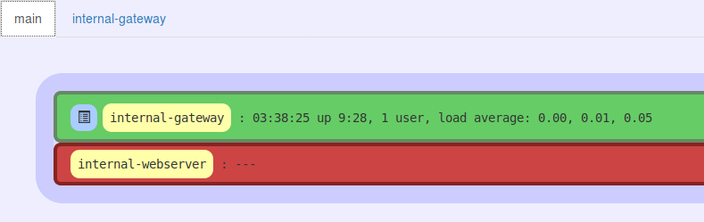
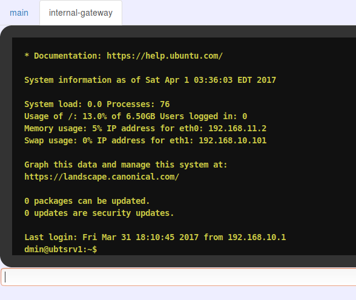

# Star-Gazer Credentials Manager
Star-Gazer is a tool for storing and using credentials for ssh and other authentication mechanisms (extensible by a plugin api).
The cli tool provides an easy mechanism for securely encrypting (aes-256-ctr with hmac-sha256) the config with a user password for safe storage.
Star-Gazer also comes with Star-Gazer-Observatory which provides an http server for viewing up/down status and connecting to servers through a server browser list.

## installation
- requires node-js and npm
- in this directory, run ```npm install``` to install all required packages for star-gazer
- in the plugins/observatory directory, run ```npm install``` to install all requirements for star-gazer observatory, or delete the observatory folder if you do not need it


## usage:

add an ssh server:
```sh
./star-gazer add ssh server-name username=myusername password=mypassword host=192.168.1.5
```

list stored credentials:
```sh
./star-gazer list
```

open a shell to a server with known credentials:
```sh
./star-gazer shell server-name
```

delete a server:
```sh
./star-gazer remove server-name
```

encrypt the config:
```sh
./star-gazer encrypt-config
<enter user password>
```
this will encrypt the config, requiring the user password whenever you start star-gazer

start the observatory server:
```sh
./star-gazer observatory
```
head over to http://localhost:3000/ to view the observatory server

## screenshots
observatory server browser:


observatory server console:



## disclaimer
This tool is not production-grade quality and is unfit for any purpose other than educational or expiremental. The project grew way out of scope for me to produce everything with high quality in a reasonable amount of time.
